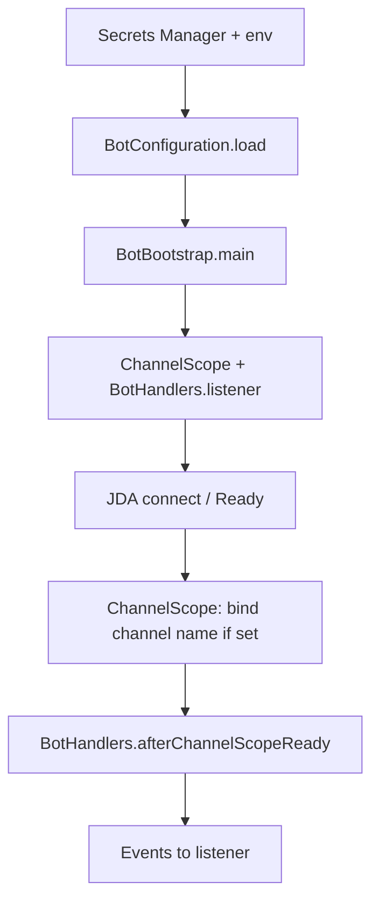

# CSCI 220 — Discord bot

Discord bot in Java ([JDA](https://github.com/DV8FromTheWorld/JDA)). The token comes from **AWS Secrets Manager**; optional **text channel name** limits commands to one channel. Put your behavior in **`BotHandlers`** (startup hook + message listener). **`BotBootstrap`** is the `main` entry point.

**Requirements:** Java **17**, **Maven**, AWS credentials on the machine, and **Message Content Intent** enabled in the [Discord Developer Portal](https://discord.com/developers/applications).

## Run

```bash
cp local.env.example local.env   # optional: AWS_PROFILE, region, secret name, channel name
bash scripts/local-deploy.sh       # laptop
bash scripts/run-bot.sh            # server (e.g. EC2; installs JDK 17 + Maven if needed)
# or:
mvn package && java -jar target/discord-bot-1.0.0.jar
```

**Main class:** `edu.moravian.csci220.discordbot.BotBootstrap`  
**Artifact:** `target/discord-bot-1.0.0.jar` (shaded)

## Configuration

| Variable | Default | Role |
|----------|---------|------|
| `AWS_REGION` | `us-east-1` | Secrets Manager region |
| `AWS_SECRET_NAME` | `220_Discord_Token` | Secret id |
| `DISCORD_CHANNEL_NAME` or `CHANNEL_NAME` | — | Overrides channel name from the secret (env wins) |

**Secret value:** plain text (= token only), or JSON with token key `DISCORD_TOKEN`, `discord_token`, or `token`, and optional channel keys `DISCORD_CHANNEL_NAME` or `CHANNEL_NAME`. If no channel name is set anywhere, the bot runs **unbound** (your listener should still check `ChannelScope` if you only want one channel).

## Where to edit

| Class | Role |
|-------|------|
| `BotHandlers` | `afterChannelScopeReady` — runs after `ChannelScope` finishes on **Ready** (good for a startup message). `listener` — return value is registered as a JDA listener (e.g. commands). |
| `ChannelScope` | Resolves channel **name** → internal id; use `isBound()`, `isTargetChannel()`, `activeTextChannel(jda)` in handlers. |
| `BotConfiguration` | Loaded once at startup from AWS + env. |
| `BotBootstrap` | Wires config, `ChannelScope`, intents, and `BotHandlers` — change here if you need extra gateway intents. |

## Flow



<<<<<<< HEAD
**Local:** `bash scripts/local-deploy.sh`  
**EC2:** `bash scripts/run-bot.sh`  
**Manual:** `mvn -q -DskipTests package && java -jar target/discord-bot-1.0.0.jar`

### CI Status


=======
>>>>>>> 1d6e26229f922ae1a73cfb9c0e1940a2a667493c
