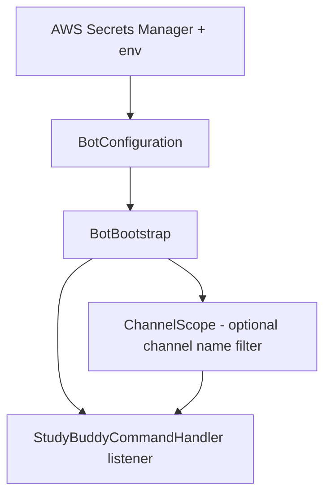

# StudyBuddy Discord Bot

Java Discord bot using [JDA](https://github.com/DV8FromTheWorld/JDA).

- **Commands / bot logic**: `edu.moravian.StudyBuddyCommandHandler`
- **Entry point**: `edu.moravian.csci220.discordbot.BotBootstrap`
- **Optional channel lock**: set a channel name so commands only run there

## Run

```bash
AWS_REGION=us-east-1 AWS_SECRET_NAME=220_Discord_Token mvn -q package && \
java -jar target/discord-bot-1.0.0.jar
```

## Config

- **AWS**: `AWS_REGION` (default `us-east-1`), `AWS_SECRET_NAME` (default `220_Discord_Token`)
- **Channel name (optional)**: `DISCORD_CHANNEL_NAME` or `CHANNEL_NAME`
- **Secret**: plain token string, or JSON with `DISCORD_TOKEN` / `discord_token` / `token`

## Flow



**Local:** `AWS_REGION=... AWS_SECRET_NAME=... mvn -q package && java -jar target/discord-bot-1.0.0.jar`

### CI Status

[](https://github.com/cs220s26/britan-jackson-alex-project-repo/actions/workflows/run_tests.yml)
