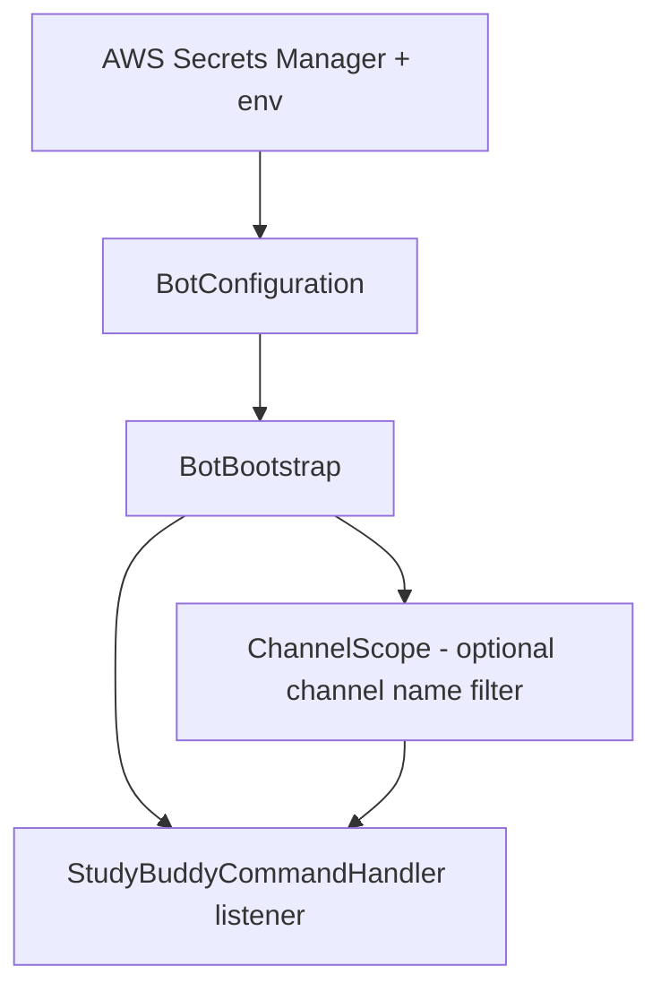

# StudyBuddy Discord Bot

Java Discord bot using [JDA](https://github.com/DV8FromTheWorld/JDA).

- **Commands / bot logic**: `edu.moravian.StudyBuddyCommandHandler`
- **Entry point**: `edu.moravian.csci220.discordbot.BotBootstrap`
- **Optional channel lock**: set a channel name so commands only run there

## Run

```bash
cp local.env.example local.env   # optional
bash scripts/local-deploy.sh      # laptop
# or: bash scripts/run-bot.sh     # server (EC2)
# or: mvn package && java -jar target/discord-bot-1.0.0.jar
```

## Config

- **AWS**: `AWS_REGION` (default `us-east-1`), `AWS_SECRET_NAME` (default `220_Discord_Token`)
- **Channel name (optional)**: `DISCORD_CHANNEL_NAME` or `CHANNEL_NAME`
- **Secret**: plain token string, or JSON with `DISCORD_TOKEN` / `discord_token` / `token`

## Flow



**Local:** `bash scripts/local-deploy.sh`  
**EC2:** `bash scripts/run-bot.sh`  
**Manual:** `mvn -q -DskipTests package && java -jar target/discord-bot-1.0.0.jar`

### CI Status


